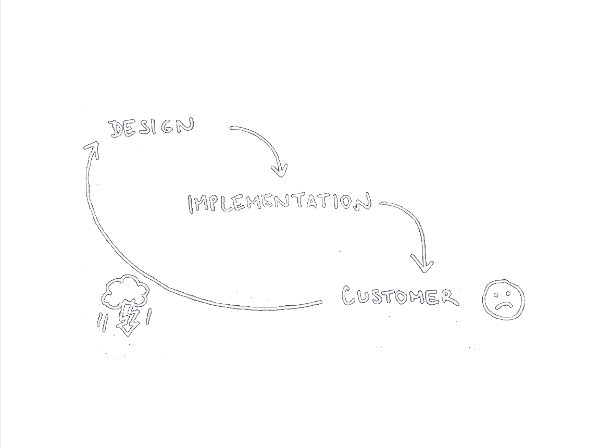
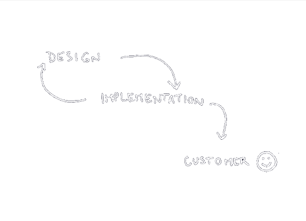
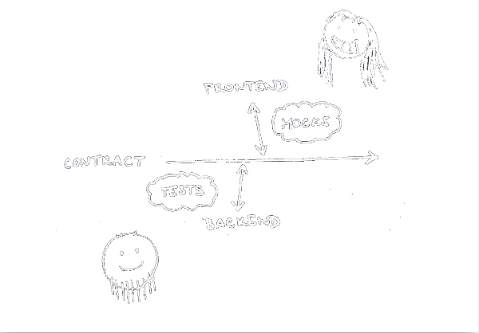

# API Design Life cycle

*Vilibald Wanča - wvi@apiary.io*

---

## Agenda

- Obvyklý vývoj API
- Jde to i jinak
- Jak jinak (Nástroje)

---

## Jak obvykle vzniká API

---

## Výsledek

- server vývojáři věští budoucnost
- "waterfall" design
- "dokumentace" je v kódu

---

## Nejčastější chyby

- Nekonzistentnost
- Nedodržování konvencí (např. HTTP kódy)
- Nesrozumitelné chybové hlášky
- Mizerná pokud nějaká dokumentace

---

## Největší problémy

> API je tak trochu uzemí nikoho

- Zájmy server vývojáře se významně liší od klient vývojáře
- Soustředíme se na technikálie

---

## Jak z toho ven

> Agilně

---

## API Design

- Prototypy
- Iterace
- Use cases
- Komunikace

---

## Jak?

- Swagger http://swagger.io/
- API Bluperint http://apibluenprint.org/
- RAML http://raml.org/

---

## Výhody

---

## Výhody

- Dokumentace
- Nástroje
- Součást repozitáře

---

## Nástroje

- Interaktivní dokumentace
- Mock server, žádný kód
- Debugování (proxy)
- Generování kódu
- Testování

---

## Demo / QA

---

# Díky za pozornost

Vilibald Wanča - wvi@apiary.io

*Děkuji Honzovi Javorkovi (@honzajavorek) za výtečné skeče.*

