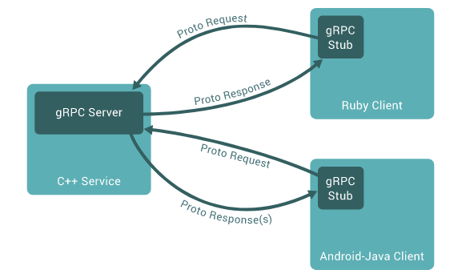

# Binary Protocols are back!
### 42 69 6e 61 72 79 20 50 72 6f 74 6f 63 6f 6c 73

*Vilibald Wanča - vilibald@wvi.cz*

---

## Outline

- Text Based vs Binary Protocols
- Bit of History 
- Current state
- Examples

*Ask questions straight away, don't wait for Q&A*

---

## I am not going to talk about

- REST APIs (maybe just the bad stuff)
- XML based APIs (long live SOAP and WSDL)


---

## Text vs. Binary

> Content representation is in human-readable format 

- SMTP
- HTTP
- Redis
- Memcached

---

### Text Example

```
GET /files/image.jpg HTTP/1.0
Connection: Keep-Alive
User-Agent: Mozilla/4.01 [en] (Win95; I)
Host: hal.etc.com.au
Accept: image/gif, image/x-xbitmap, image/jpeg, image/pjpeg, */*
Accept-Language: en
Accept-Charset: iso-8859-1,*,utf-8
```
```
HTTP/1.1 200 OK
Date: Mon, 19 Jan 1998 03:52:51 GMT
Server: Apache/1.2.4
Last-Modified: Wed, 08 Oct 1997 04:15:24 GMT
ETag: "61a85-17c3-343b08dc"
Content-Length: 60830
Accept-Ranges: bytes
Keep-Alive: timeout=15, max=100
Connection: Keep-Alive
Content-Type: image/jpeg

<binary data goes here>
```
---

## Text vs. Binary

> Content is intended to be read by a machine rather than a human being

- RTP
- TCP
- gRPC

---

##  Binary Example

```
-,%~dzd~(&]==><&U%)_jEW
                       E$RKReV_>:^14312d[gsRfXw%'*\z-7K[r4j}7GyGAF4-,B

    dۇE. ]pUx5OYjE
                            6Osi!3z}N
```

```
4KHV56bK A$,LѧO|.t<>Ciw=ޠ׎q@WkVջ
AwF^f8R85=;\0
              $,L<I@jUf@~"
                          T
                           v!4
                              mVVp0fPIO}MC!-. 嬱;kjUcՉ55A@Ъd<To
VeJ}HZim|k4(#@͵T6ɧXʥja)2Q:a O<q?{)r;OqUd52U
                                           AQDxu_'Wj=ImU
C2"p/Y7F)"R+%                                 }Vr}g>k~YbB1H@R-P<d
             qvUU=ZG/n_̂ad*X
```

---

## Key properties

> Text

<p class="fragment" data-fragment-index="1">Easy to use for humans</p>
<p class="fragment" data-fragment-index="2">Easy to create a client (telnet)</p>
<p class="fragment" data-fragment-index="3">Easy to port to different architectures</p>
<p class="fragment" data-fragment-index="4">Not very compact (large in size)</p>

---

## Key properties

> Binary

<p class="fragment" data-fragment-index="1">Usually very compact</p>
<p class="fragment" data-fragment-index="2">Low overhead in encoding/decoding</p>
<p class="fragment" data-fragment-index="3">Need special tools for debugging (hexdump)</p>
<p class="fragment" data-fragment-index="4">Network byte order problem</p>

---

## History lesson

> First protocol?

<p class="fragment" data-fragment-index="1">Morse code</p>
<p class="fragment" data-fragment-index="2">Entropy encoding included!</p>

---

## History lesson - RPC

> Remote Procedure Call - Call remote procedures as if they are local

- Open Network Computing (ONC) Remote Procedure Call (RPC) - 1984
- Network File System (NFS) - 1989
- Common Object Request Broker Architecture (CORBA) - 1991
- gRPC Remote Procedure Calls (gRPC) - 2015

---

## Vocabulary

### IDL

> Interface description language

- ASN.1 (X.509)
- OpenAPI Specification a.k.a. Swagger
- Protocol Buffers

---

```
FooProtocol DEFINITIONS ::= BEGIN

    FooQuestion ::= SEQUENCE {
        trackingNumber INTEGER,
        question       IA5String
    }

    FooAnswer ::= SEQUENCE {
        questionNumber INTEGER,
        answer         BOOLEAN
    }

END
```

---

```yaml
openapi: "3.0.0"
info:
  version: 1.0.0
  title: Swagger Petstore
  license:
    name: MIT
servers:
  - url: http://petstore.swagger.io/v1
paths:
  /pets:
    get:
      summary: List all pets
      operationId: listPets
      tags:
        - pets
      parameters:
        - name: limit
          in: query
          description: How many items to return at one time (max 100)
          required: false
          schema:
            type: integer
            format: int32
      responses:
        '200':
...
```

---

```
syntax = "proto3";
package example;

message Person {
  string name = 1;
  int32 id = 2;  // Unique ID number for this person.
  string email = 3;

  enum PhoneType {
    MOBILE = 0;
    HOME = 1;
    WORK = 2;
  }

  message PhoneNumber {
    string number = 1;
    PhoneType type = 2;
  }

}
```
---

## Current state

> Web APIs usually don't scale as great in the microservices world

- Swagger code generation (clients and SDKs)
- Apache Thrift - originally Facebook 2007, open source 2008
- gRPC - originally Google 200x and open source 2015

---

## Current state

> IoT has limited resources - JSON alternatives no IDL

- MessagePack
- CBOR

---

## JSON is cool but ...

> What if size or memory matters?

CBOR and MessagePack to the rescue!

- CBOR - cbor.io 
- MessagePack - msgpack.org

Well they are basically the same. The difference is that CBOR is RFC 7049.

---

## MessagePack

```json
{"id":1,"age":56,"bornyear":1963,"date":3,"month":7,"weight":67.5}
```
```
86 a2 69 64 01 a3 61 67  65 38 a8 62 6f 72 6e 79  |..id..age8.borny|
65 61 72 cd 07 ab a4 64  61 74 65 03 a5 6d 6f 6e  |ear....date..mon|
74 68 07 a6 77 65 69 67  68 74 cb 40 50 e0 00 00  |th..weight.@P...|
00 00 00                                          |...|
```
---

## MessagePack

```js
myJSON = JSON.stringify(myObject);
myObject = JSON.parse(myJSON);
```

```js
myMsgPack = msgpack.pack(myObject);
myObject = msgpack.unpack(myMsgPack);
```

## RPC is back too!

> Pick your poison

- Full blown RPC framework like Apache Thrift or gRPC.
- Run your own and stand on the shoulders of giants

---

## How it works?

<p class="fragment" data-fragment-index="1">1. Define your API in the IDL</p>
<p class="fragment" data-fragment-index="2">2. Compile/generate client/server stubs</p>
<p class="fragment" data-fragment-index="3">3. Implement the service as required</p>
<p class="fragment" data-fragment-index="4">4. $$$$</p>

---

## Thrift vs gRPC

- IDL
- Evolving
- Strong Typing
- Reflection
- Many languages

---

## gRPC (grpc.io)



---

## gRPC IDL

```
syntax = "proto3";
package phonebook;

message Person {
  required string name = 1;
  required int32 id = 2;
  optional string email = 3;

  enum PhoneType {
    MOBILE = 0;
    HOME = 1;
    WORK = 2;
  }

  message PhoneNumber {
    required string number = 1;
    optional PhoneType type = 2 [default = HOME];
  }

  repeated PhoneNumber phones = 4;
}

```

---

## gRPC

- uses HTTP/2 (binary, compressed)
- every RPC call is a separate stream in the same TCP/IP connection.
- supports streaming both ways too

---

### Thrift


---

## Thrift IDL

```
enum PhoneType {
  HOME,
  WORK,
  MOBILE
}

struct Phone {
  1: i32 id,
  2: string number,
  3: PhoneType type
}

service PhoneService {
  Phone findById(1: i32 id),
  list<Phone> findAll()
}
```

---

## Thrift

- supports container types list, set and map
- many options on transport and serialization even HTTP + JSON
- great support in java hadoop world

---

## Summary 

> Binary is the new black!

---

## This presentation is over


