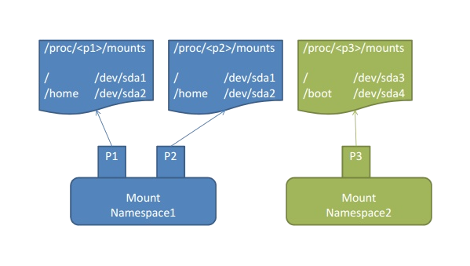

# Linux Containers DIY
### Přemek Podlaha dělá docker


*Vilibald Wanča - vilibald@wvi.cz*

---

## Vilibald

- 15+ let ve vývoji
- Basic -> Pascal -> asm x86 -> C/C++ -> Python, Lisp, Go
- Unix/Linux uživatel od 1997 (SCO Unix a Slackware)

*V současnosti digitální proletář v Apiary (apiary.io)*

---

## Agenda


---

## O čem budeme mluvit

- Co je to ten kontejner?
- Namespaces
- Cgroups
- Síť
- Image
- Lepíme to dohromady

*Ptejte se hned a nečekejte na konec*

---

## Co je to ten kontejner?

> Osekaná VM nebo něco jiného?

<blockquote>
<p class="fragment" data-fragment-index="1">Obvyklý(é) Linux proces(y)
s omezeným viděním světa.</p>
</blockquote>

---

## Omezování procesů v Linuxu

> Vlastnosti kernelu

- Namespaces
- Cgroups aka Control Groups
- Síť (bridge, iptables atd.)
- SELinux/AppArmor

---

## Namespaces

> Izolace na základě zdrojů

- Mount (2.4.19)
- UTS (2.6.19)
- IPC (2.6.19)
- PID (2.6.24)
- Network (2.6.29)
- User (3.8)
- Cgroups (4.6)

---

## Jak vznikají

> Systémová volání

- `clone()`
- `unshare()`
- `setns()`

---

## Mount namespace



---

## PID namespace


---

## Control groups

> Mechanismus pro kontrolu, prioritizaci a účetnictví procesů

+ *blkio* - limity na IO
+ *cpu* - cpu scheduling
+ *cpuset* - přiřazování CPU na multicore
+ *devices* - přístup k zařízením
+ *memory* - paměťové limity (rss, swap atd.)

> /sys/fs/cgroup/

---

## Síť

> Virtuální zařízení (veth), Linux bridge

a hlavně:


---

## Image

> Co je ve skutečnosti image kontejneru?

<blockquote>
<p class="fragment" data-fragment-index="1">JE TO JENOM TARBALL</p></br>
<p class="fragment" data-fragment-index="2"><small> nebo tarball plný
dalších tarballů v sofistikované verzi</small></p>
</blockquote>

---

## Slepíme to dohromady I

```
main():

    flags =  SIGCHLD | CLONE_NEWNS | CLONE_NEWPID ....

    pid = clone(container_exec, stack.ptr, flags, args);

    setup_network_and_cgroups();

    waitpid(pid);

    exit();

```

---

## Slepíme to dohromady II

```
container_exec(args):

    umount("/proc");
    pivot_root("/tmp/container", "/tmp/container/.pivot_root");
    chdir("/");
    copy_files("/.pivot_root/etc/resolv.conf", ...);
    umount("/.pivot_root");
    mount("/proc", "proc");
    mount("/dev", "devtmpfs")
    sethostname("container");
    setup_network();
    rc = execvp(args[0], args);
    return rc;
```

---

## Slepíme to dohromady (Filesystem)

> Image + tmp = union fs

- aufs
- overlayFS
- vfs
- btrfs
- devicemapper

---

## Slepíme to dohromady (Síť)


---

## Čas na demo

[https://github.com/w-vi/diyc](https://github.com/w-vi/diyc)


---

## Díky za pozornost

Vilibald Wanča

[vilibald@wvi.cz]()


