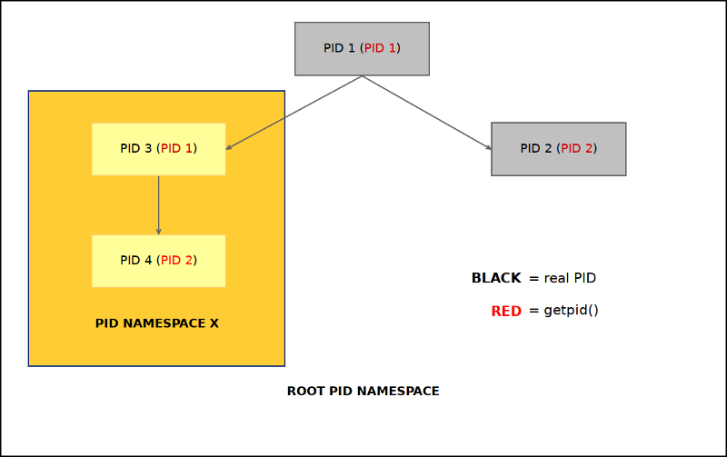
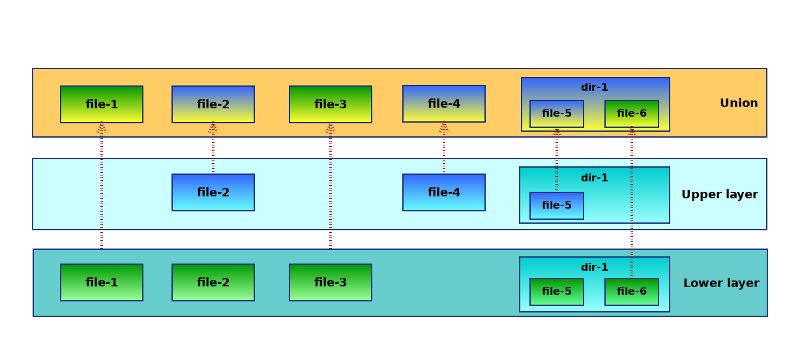
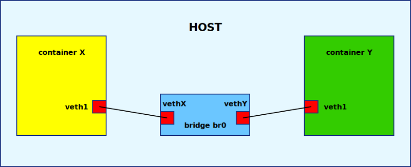

# Linux Containers DIY

*Vilibald Wanča - vilibald@wvi.cz*

---

## My first experience


---

## What we are going to talk about

- What is a container?
- Namespaces
- Cgroups
- Networking
- Container Image
- Gluing it together

---

## So what really is a container?

> Lightweight VM or something else?

<blockquote>
<p class="fragment" data-fragment-index="1">Ordinary Linux process(es) with a
limited (altered) view of the world.</p>
</blockquote>

---

## Limiting a process in Linux

> Kernel features

- Namespaces
- Cgroups a.k.a Control Groups
- Networking (bridge, iptables etc.)
- SELinux/AppArmor

---

## Namespaces

> Resource level isolation

- Mount (2.4.19)
- UTS (2.6.19)
- IPC (2.6.19)
- PID (2.6.24)
- Network (2.6.29)
- User (3.8)
- Cgroups (4.6)

---

## How you create one?

> Syscalls

- `clone()`
- `unshare()`
- `setns()`

---

## Mount namespace


---


## PID namespace




---


## Control groups

> Limit, police and account resource usage for a set of processes

+ *blkio* - limits on IO
+ *cpu* - cpu scheduling
+ *cpuset* - assigns CPU(s)n on multicore systems
+ *devices* - controls access to devices
+ *memory* - memory limits like rss, swap etc.

> /sys/fs/cgroup/

---

```bash

$ mkdir /sys/fs/cgroup/memory/mygroup
$ ls -la /sys/fs/cgroup/memory/mygroup

total 0
drwxr-xr-x 2 root root 0 28.04.2017 13:05 ./
dr-xr-xr-x 6 root root 0 28.04.2017 13:03 ../
-rw-r--r-- 1 root root 0 28.04.2017 13:05 cgroup.clone_children
--w--w--w- 1 root root 0 28.04.2017 13:05 cgroup.event_control
-rw-r--r-- 1 root root 0 28.04.2017 13:05 cgroup.procs
-rw-r--r-- 1 root root 0 28.04.2017 13:05 memory.failcnt
--w------- 1 root root 0 28.04.2017 13:05 memory.force_empty
...
-rw-r--r-- 1 root root 0 28.04.2017 13:05 memory.use_hierarchy
-rw-r--r-- 1 root root 0 28.04.2017 13:05 notify_on_release
-rw-r--r-- 1 root root 0 28.04.2017 13:05 tasks

```
---

## Network

> Virtual devices (veth), Linux bridge

and most importantly:


---

## Image

> What is actually is a container image?

<blockquote>
<p class="fragment" data-fragment-index="1">IT'S JUST A TARBALL</p></br>
<p class="fragment" data-fragment-index="2"><small> or tarball of tarballs in
some more sophisticated structure</small></p>
</blockquote>

---

## Let's glue it together I

```
main():

    flags =  SIGCHLD | CLONE_NEWNS | CLONE_NEWPID ....

    pid = clone(container_exec, stack.ptr, flags, args);

    setup_network_and_cgroups();

    waitpid(pid);

    exit();

```

---

## Let's glue it together II

```
container_exec(args):

    umount("/proc");
    pivot_root("/tmp/container", "/tmp/container/.pivot_root");
    chdir("/");
    copy_files("/.pivot_root/etc/resolv.conf", ...);
    umount("/.pivot_root");
    mount("/proc", "proc");
    mount("/dev", "devtmpfs")
    sethostname("container");
    setup_network();
    rc = execvp(args[0], args);
    return rc;
```

---

## Let's glue it together (Filesystem)

> Image + tmp = union fs

- aufs
- overlayFS
- vfs
- btrfs
- devicemapper

---

## Union filesystem



---

## Let's glue it together (Network)



---

## Demo time

[https://github.com/w-vi/diyc](https://github.com/w-vi/diyc)


---

## Thanks for you attention

Vilibald Wanča

[vilibald@wvi.cz]()


