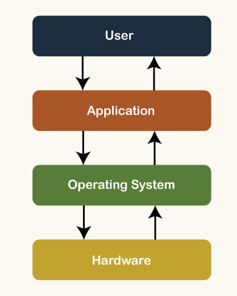
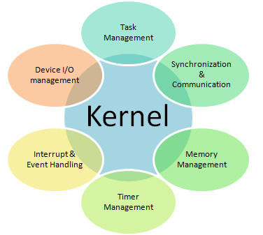
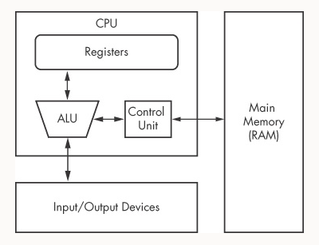
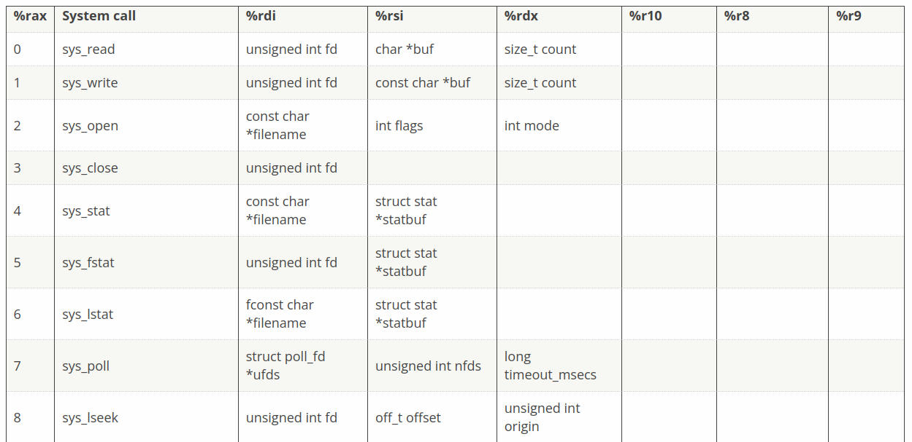

# Low level Go interfacing the OS

Vilibald Wanča

31 May 2022

vilibald@wvi.cz

---

## Vilibald

> Basic->Pascal->asm->C->Js->Py->Lisp->Go

- 20+ years of programming
- 30 000+ km ridden on a fixed gear bike
- ~1200 km the longest walk
- 800+ vinyl records in collection


---

## What is OS



---

## What is Kernel



---

## System Call

> Wikipedia

In computing, a system call (commonly abbreviated to syscall) is the programmatic way in which a computer program requests a service from the kernel of the operating system on which it is executed. This may include hardware-related services (for example, accessing a hard disk drive or accessing the device's camera), creation and execution of new processes, and communication with integral kernel services such as process scheduling. System calls provide an essential interface between a process and the operating system.

---

## Have you ever used a syscall?

```golang
package main

import (
    "fmt"
)

func main() {

    fmt.Println("Any syscall around?")
}
```

---

## How to make a call



---

## Syscall table



---

## Windows have them too but ...

[https://github.com/j00ru/windows-syscalls](https://github.com/j00ru/windows-syscalls)

---

## How to debug a syscall

> `strace` to the rescue

Filter syscall

    strace --trace=write program

Filter syscall group

    strace --trace=network nc localhost 8080

[https://strace.io/](https://strace.io/)

---

## Phew that's what I call low level

---

## Signals

> (p)killing it

<p class="fragment" data-fragment-index="1">kill -9 pid</p>
<p class="fragment" data-fragment-index="2">kill -SIGKILL pid</p>
<p class="fragment" data-fragment-index="3">man 7 signal</p>

---

## SIGINT/SIGTERM/SIGQUIT

<p class="fragment" data-fragment-index="1">SIGINT = Ctrl + C (means interrupt)</p>
<p class="fragment" data-fragment-index="2">SIGTERM = Terminate (default kill,
value 15) </p>
<p class="fragment" data-fragment-index="3">SIGQUIT = Terminate with core dump</p>

---

## SIGUSR1/SIGUSR2

<p class="fragment" data-fragment-index="1">Signals with no meaning by default, left for programs to define</p>
<p class="fragment" data-fragment-index="2">Useful sometimes, reloading config or inc/dec log verbosity</p>

---

## os/signal

[https://pkg.go.dev/os/signal](https://pkg.go.dev/os/signal)

```golang
package main

import (
    "fmt"
    "os"
    "os/signal"
    "syscall"
)

func main() {
    sigs := make(chan os.Signal, 1)
    signal.Notify(sigs, syscall.SIGINT, syscall.SIGTERM)
    fmt.Printf("Waiting for signal, pid: %d\n", os.Getpid())

    sig := <-sigs

    fmt.Println("Program ", sig)
}

```

---

## Thank you

[vilibald@wvi.cz]()


