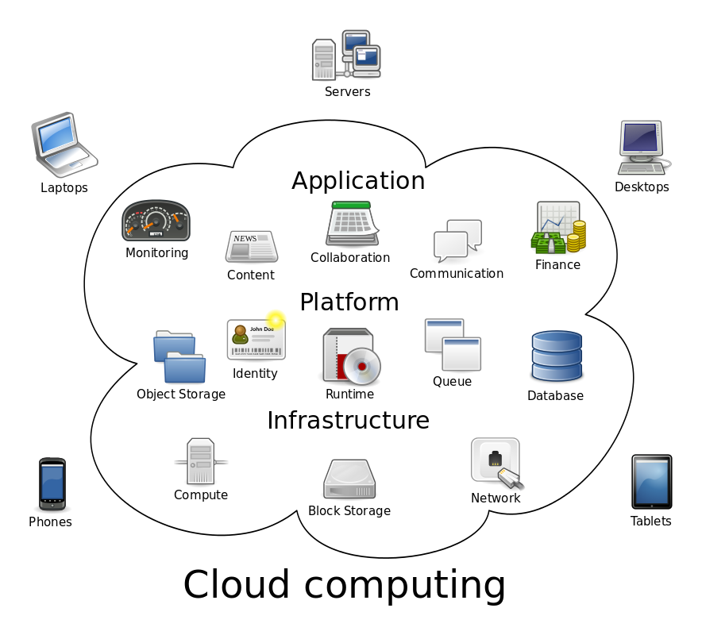
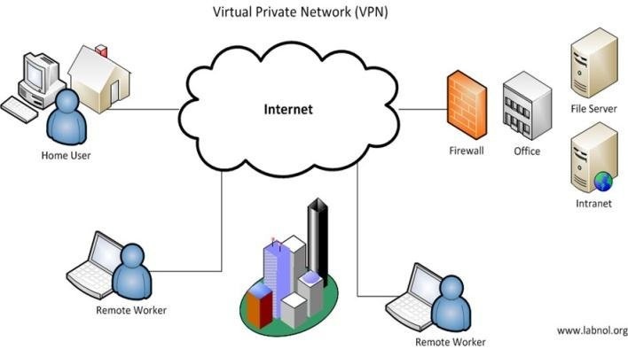
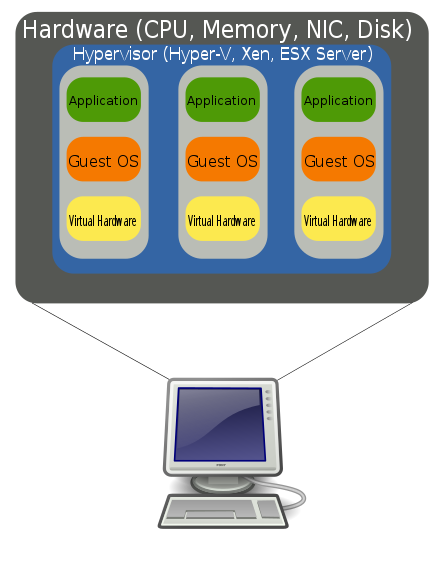
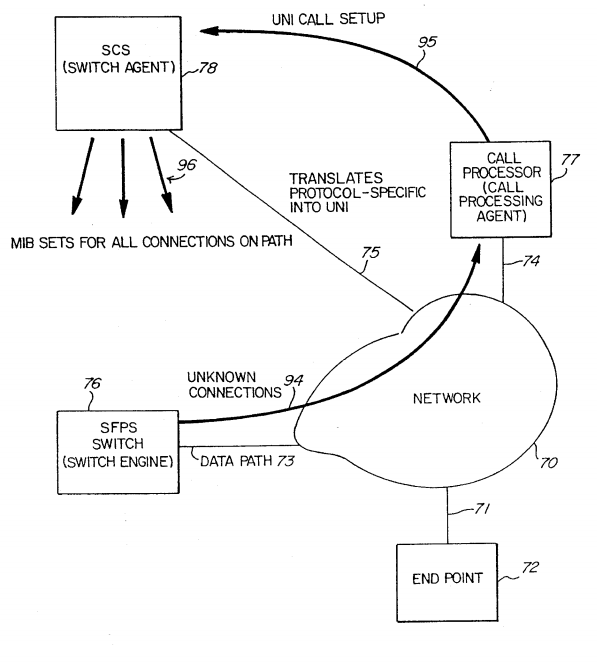
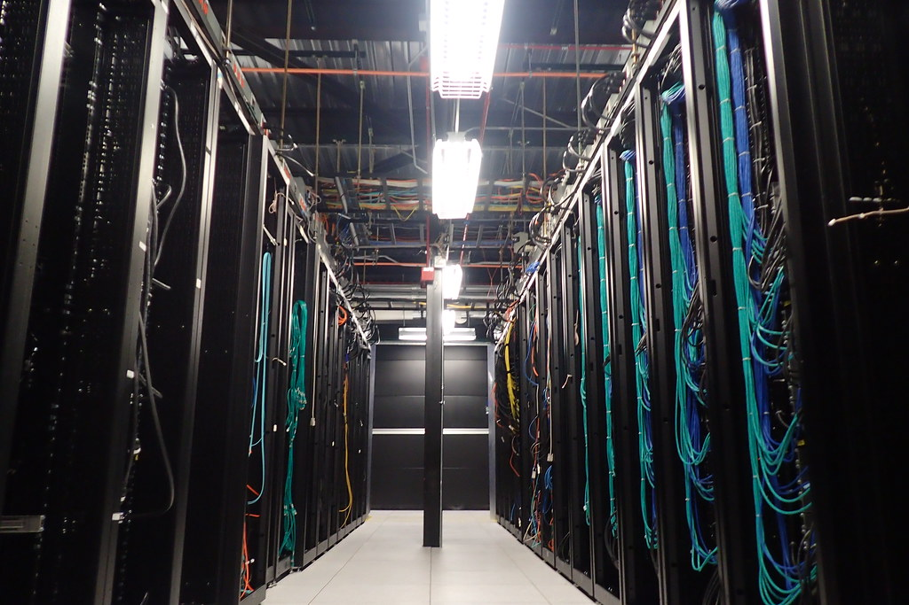
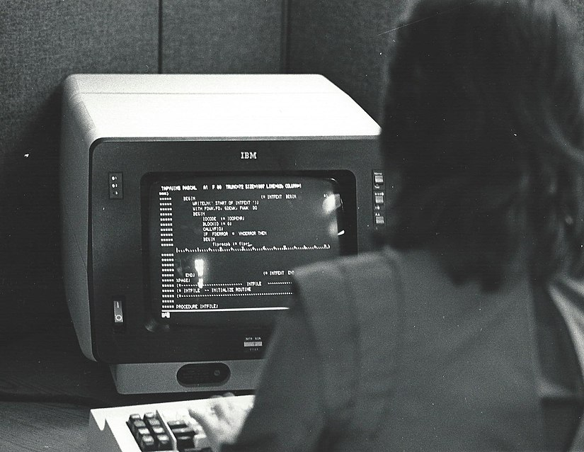

# Co je to Cloud

*Vilibald Wanča - vilibald@wvi.cz*

---

## Vilibald

- Vice než 25 let programuje
- Tvůrce navigace na serveru mapy.cz

*V současnosti digitální proletář budující cloud v Oracle*

---

## O čem budeme mluvit

- Cloud jakože Mrak ?!?
- Jak se to stalo?
- Cloud neexistuje!

*Ptejte se hned a nečekejte na konec. (Zvedněte ruku)*

---

## Mraky termínů

 <!-- .element height="35%" width="35%" -->

---

## WT*?!?

- IaaS
- PaaS
- SaaS
- VPS
- VPN
- Virtualizace

---

## Cloud computing

 <!-- .element height="65%" width="65%" -->

---

## SaaS

 <!-- .element height="35%" width="35%" -->

- Software as a Service (Software jako služba)

---

## VPN

 <!-- .element height="35%" width="35%" -->

- Virtual Private Network (Virtuální privátní síť)

---

## Virtualizace

 <!-- .element height="45%" width="45%" -->

---

## Proč cloud?

 <!-- .element height="45%" width="45%" -->

---

## Výpočetní výkon jako komodita

 <!-- .element height="65%" width="65%" -->

---

## Vývoj

- batch processing (50. léta)
- time sharing (60. léta)
- virtualizace (70. léta)
- virtualizace sítí (80.-90. léta)
- moderní cloud (2000-)

---

## Batch processing

 <!-- .element height="65%" width="65%" -->

---

## Time sharing

 <!-- .element height="65%" width="65%" -->

---

## Cloud v 70. letech

 <!-- .element height="65%" width="65%" -->

---

## Virtualizace

 <!-- .element height="65%" width="65%" -->

---

## Virtuálně a nikdy jinak

- Emulace (simuluje se jiný HW)
- Částečná/Plná virtualizace (sdílí se stejný HW)
- Virtualizace OS
- Virtualizace aplikační

---

## VPN + Virtualizace = Cloud

- 2003 Amazon Web Services
- 2008 Google App Engine
- 2010 Microsoft Azure

---

## Datacentra nebo Mainframe

 <!-- .element height="65%" width="65%" -->

---

## Datacentra nebo Mainframe

 <!-- .element height="65%" width="65%" -->

---

## Cloud v 2021

 <!-- .element height="65%" width="65%" -->

---

## Virtualbox

 <!-- .element height="25%" width="25%" -->

> [https://www.virtualbox.org/](https://www.virtualbox.org/)

---

## Díky za pozornost

Vilibald Wanča

[vilibald@wvi.cz]()

