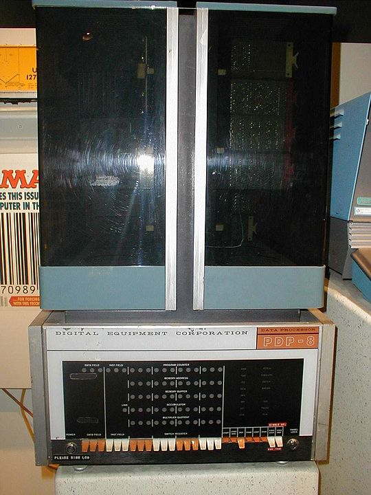
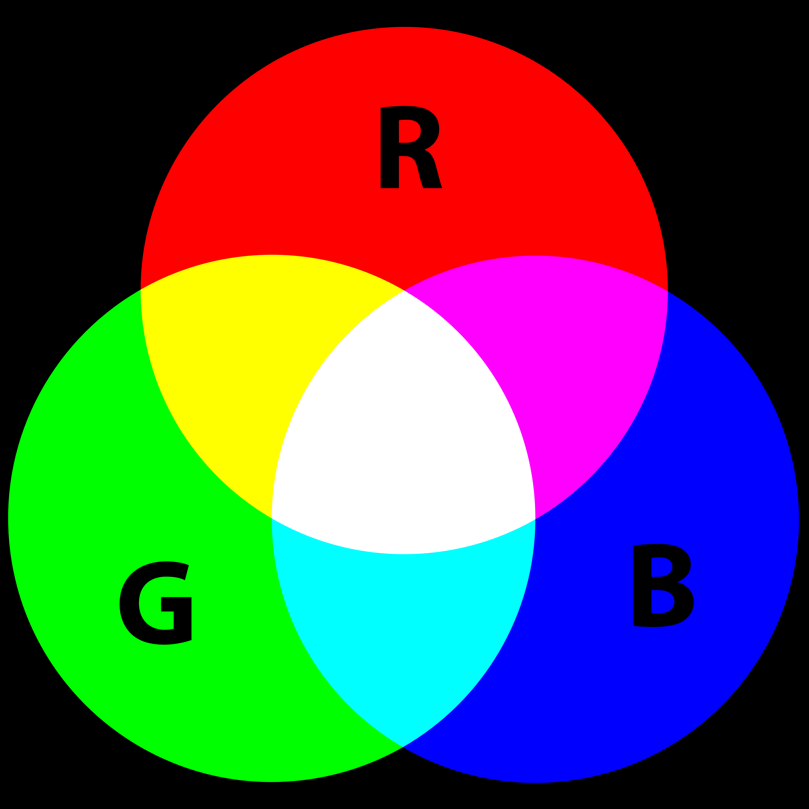
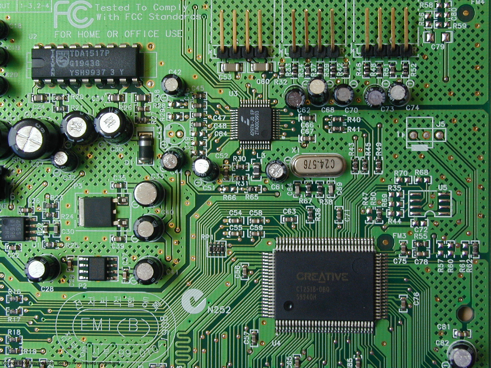

# Free Software

*Vilibald Wanča - vilibald@wvi.cz*

<hr width="75%">
<blockquote>
<small>
<ul>
<li>Prosím vypněte si kameru a mikrofon (pokud již nejsou)</li>
<li>V "Settings -> Profile" si nastavte jméno</li>
<li>Začneme v 14:10
</ul>
</small>
</blockquote>

---

## Vilibald

- Vice než 20 let programuje
- Uživatel free software od cca 1997
- Spolutvůrce serveru mapy.cz

*V současnosti digitální proletář budující cloud v Oracle*

---

## O čem budeme mluvit

- Informatika za 21 ~~dní~~ minut
- Free Software
- Používá to vůbec někdo ?
- Proč mě to má zajímat ?

*Ptejte se hned a nečekejte na konec. (Zvedněte ruku)*

---

## Informatika za 21 ~~dní~~ minut

> Software, hardware, počítač?

<blockquote>
<p class="fragment" data-fragment-index="1">1) Co je počítač?</p>
<p class="fragment" data-fragment-index="2">2) 10 skupiny. Binární soustava a data.</p>
<p class="fragment" data-fragment-index="3">3) Logika a obvody.</p>
<p class="fragment" data-fragment-index="4">4) Hardware vs. Software</p>
</blockquote>

---

## I. Co je to počítač?

> Stroj provádějící logické a aritmetické operace v daném pořadí.

- Analogové (19. století)
- Číslicové (digitální, 20. století)

---

## Počítač


---

## Trocha historie I. - ENIAC (1945)

 <!-- .element height="70%" width="70%" -->

---

## Trocha historie II. - IBM 360 (1964)

 <!-- .element height="70%" width="70%" -->

---

## Trocha historie III. - PDP-8 (1965)

 <!-- .element height="40%" width="40%" -->

---

## II. 10 skupiny lidí

+ Reprezentace informace
+ 1,2,3 .... 64 bitů
+ Dvojková soustava
+ Text, obrázek, zvuk?

---

## Informace jako elektrický signál

> 1 drát = 1 bit

 <!-- .element height="40%" width="40%" -->

---

## 64 Bitů

- 1 drát : 0, 1
- 2 dráty : 00, 01, 10, 11
- 3 dráty : 000, 001, 010, 011, 100, 101, 110, 111
 ....
- 64 drátů : 0 až 18446744073709551615

 <!-- .element height="60%" width="60%" -->

---

## Číselné soustavy

<p class="fragment" data-fragment-index="1">0, 1, 2, 3, 4, 5, 6, 7, 8, 9</p></br>
<p class="fragment" data-fragment-index="2">0, 1</p>

---

## Desítková soustava

<blockquote>
<p class="fragment" data-fragment-index="1">4321</p><br/>
<p class="fragment" data-fragment-index="2">0801</p>
</blockquote>

---

## Dvojková soustava

<blockquote>
<p class="fragment" data-fragment-index="1">101</p><br/>
<p class="fragment" data-fragment-index="2">1001</p>
<p class="fragment" data-fragment-index="3">1001 + 0001</p>
<p class="fragment" data-fragment-index="4">1001 + 0001 = 1010</p>
</blockquote>

---

## Text

 <!-- .element height="70%" width="70%" -->

---

## Obraz I

 <!-- .element height="50%" width="50%" -->

---

## Obraz II


---

## Zvuk

 <!-- .element height="70%" width="70%" -->

---

## DA převodník

 <!-- .element height="50%" width="50%" -->

---

## III. Logika a obvody

 <!-- .element height="70%" width="70%" -->

---

## Obvod

> Zpracovává/mění vstupní signál na výstupní

<p class="fragment" data-fragment-index="1">Logické operace</p>
<p class="fragment" data-fragment-index="2">Aritmetické operace</p>

---

## Logické obvody


---

## Aritmetické obvody (Poloviční sčítačka)


---

## Aritmetické obvody (Sčítačka)


---

## Aritmetické obvody (4 bitová sčítačka)

 <!-- .element height="30%" width="30%" -->

<p class="fragment" data-fragment-index="1">&nbsp;&nbsp;1010</p>
<p class="fragment" data-fragment-index="1">+ 0010</p>
<p class="fragment" data-fragment-index="1">-----------</p>
<p class="fragment" data-fragment-index="2">&nbsp;&nbsp;1100</p>

---

## IV. Hardware vs. Software


---

## Hardware

> označuje veškeré fyzicky existující technické vybavení počítače

 <!-- .element height="50%" width="50%" -->

---

## Software

> neboli programové vybavení je sada všech počítačových programů používaných v počítači

- systémový software, který zajišťuje chod samotného počítače a jeho styk s okolím
- aplikační software, všechno ostatní

 <!-- .element height="30%" width="30%" -->

---

## Central processing Unit (CPU)

 <!-- .element height="75%" width="75%" -->

---

## Procesor

> řízen instrukcemi, mikroprogramy

- LOAD A
- LOAD B
- ADD A, B
- STORE X

---

## Programování (C)

```C
    tree_node_t * t = NULL;
    char buff[128];

    t = hash_tab_lookup(nodes_tab, node_str(buff, CONST_T, val, 0, 0));
    if(NULL == t)
    {
        if(NULL != (t = new_node()))
        {
            t->attr.symbol =  st_insert_const(val);
            t->flags.leaf = TRUE;
            if(HASH_OK != hash_tab_insert(nodes_tab, buff, (void *)t))
            {
                free(t);
                t = NULL;
            }
        }
    }
```

---

## Programování (Python)

```py
def flusher(func):
    if func in flusher.flushed:
        return flusher.flushed[func]

    @wraps(func)
    def call(*args, **kwargs):
        result = func(*args, **kwargs)
        sys.stderr.flush()
        sys.stdout.flush()
        return result
    flusher.flushed[func] = call
    return call


flusher.flushed = {}
```

---

## Operační systém

> Základní program všech programů

- řídí přístup ke všem zařízením
- spouští ostatní programy
- rozhoduje, který program poběží na CPU
- řídí souborový systém a přístup k němu

---

## Free/Open Source Software


---

## Definice

<p class="fragment" data-fragment-index="1">0. svoboda používat program za jakýmkoliv účelem</p>
<p class="fragment" data-fragment-index="2">1. svoboda studovat a přizpůsobovat program svým potřebám</p>
<p class="fragment" data-fragment-index="3">2. svoboda redistribuovat kopie programu.</p>
<p class="fragment" data-fragment-index="4">3. svoboda vylepšovat program a zveřejňovat zlepšení</p>

---

## Vlastnosti

- Volná redistribuce
- Zdrojový kód
- Modifikace a odvozené práce
- Integrita autorova kódu
- Žádná diskriminace lidí nebo skupin.
- Žádná diskriminace pole užití
- Licence platí pro všechny
- Licence nesmí být specifická pro produkt
- Licence nesmí omezovat ostatní software

---

## Historie


> 1979 - TeX - sázecí software <br/>
> 1984 - Free Software Foundation a GNU (GNU's Not Unix)

 <!-- .element height="30%" width="30%" -->

---

## Historie II.

- 1991 Linux kernel
- 1995 Apache HTTP Server
- 1998 Netscape -> Mozilla
- 1998 WebKit (Safari, Chrome, Opera)
- 2000 Audacity
- 2003 Wordpress
- 2008 Android

---

## Používá to vůbec někdo?

> 2015 98.1% internetových serverů používá Linux nebo FreeBSD <br/><br/>
> 2015 54.2% chytrých telefonů je Android

---

## Proč mě to má zajímat?

 <!-- .element height="35%" width="35%" -->

---

## Díky za pozornost

Vilibald Wanča

[vilibald@wvi.cz]()


