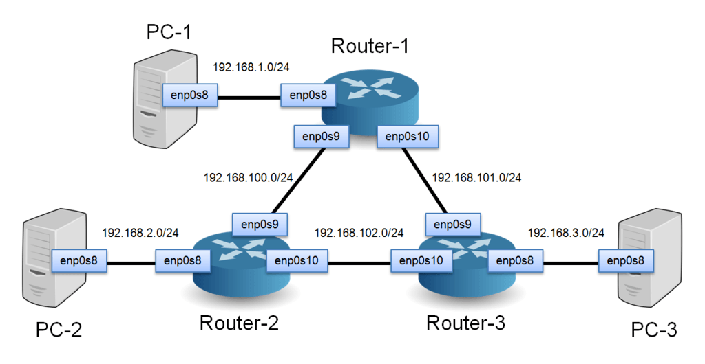

# Život HTTP požadavku

*Vilibald Wanča - vilibald@wvi.cz*

---

## Vilibald

> Basic->Pascal->asmx86->C/C++->Javascript->Python->Lisp->Go

- 20+ let programování
- 30K+ Km najeto na furtošlapu
- 1200+ Km nejdelší procházka
- 800+ vynilových desek ve sbírce
- 20 KW nejsilnější soundsystém na kterém hrál

*V současnosti digitální proletář budující cloud v Oracle*

---

## O čem budeme mluvit

> Počítačové sítě a Internet za 45 ~~dní~~ minut

Cílem není všechno si zapamatovat, ale utvořit si správný mentální model a
získat praktické tipy co dělat, když něco nefunguje.

---

## Kamera, klapka .... jedem!

`$ curl https://blesk.cz/`

---

## URL nebo URI nebo jak to je?


- `mailto:vilibald@wvi.cz?subject=A%20Test&body=My%20idea%20is%3A%20%0A`
- `ssh://wvi;fingerprint=ssh-dss-c1-b1-30-29-d7-b8-de-6c-97-77-10-d7-46-41-63-87@wvi.cz`
- `rtmp://video.rootsnfuture.org:1935/live/123456789`

## DNS (Domain Name System)

> Systém jak převést jméno jako `blesk.cz` na počítačům srozumitelnou adresu
> `91.235.52.165`

- Telefonní seznam internetu
- Hierarchický a decentralizovaný systém

---

## DNS


---

## DNS záznamy

- **A** IP adresa v4
- **AAAA** IP adresa v6
- **CNAME** - alias
- **MX** - email servery

*X dalších, ale to je na jinou přednášku*

---

## Nástroje pro DNS

- `$ dig blesk.cz`
- `$ nslookup blesk.cz`
- `$ getent hosts blesk.cz`
- `$ whois blesk.cz`

---

## Konečně nějaký drby!

> Už víme na kterém serveru je blesk.cz, takže pokračujeme ...

`$ curl https://blesk.cz/`

Blesk servíruje HTML přes HTTP, takže co to je to HTTP

---

## HTTP(s)

> HTTP = Hypertext Transfer Protocol

- Původně pro přenos hyper textu z roku 1989
- Dneska se tím posílá v podstatě všechno
- Je to bezstavový klient-server, request-response protokol
- Původně byl čistě textový, ale s HTTP/2/3 je všechno jinak
- Používá jiné protokoly pro přenos, většinou TCP v případě HTTP/3 pak QUIC

*S* v HTTP*S* říká, že spojení je šifrované, o tom za chvíli.

---

## HTTP Request

- Takzvaná request line : `<METODA> <URI> HTTP/<VERZE> <CRLF>`

- Žádná nebo více hlaviček oddělené ASCII znaky CR a LF (nový řádek)

- Prázdný řádek, tj. řádek jen s CRLF jako signál, že hlavičky skončili

- Může následovat tělo požadavku, jestli nějaké existuje

---

## Metody

- GET: Požadavek na uvedený objekt
- HEAD: Podobná GET, avšak nepředává data jen metadata
- POST: Odesílá uživatelská data na server.
- PUT: Nahraje data na server na uvedené URI
- DELETE: Smaže uvedený objekt ze serveru
- OPTIONS: Jaké metody objekt/server podporuje

*Zdaleka ne všechny*

## HTTP Request

```
GET / HTTP/1.1
Host: blesk.cz
User-Agent: curl/7.76.1
Accept: */*

```
---

## HTTP Request

```
POST /cgi-bin/process.cgi HTTP/1.1
User-Agent: Mozilla/4.0 (compatible; MSIE5.01; Windows NT)
Host: www.tutorialspoint.com
Content-Type: application/x-www-form-urlencoded
Content-Length: length
Accept-Language: en-us
Accept-Encoding: gzip, deflate
Connection: Keep-Alive

licenseID=string&content=string&/paramsXML=string
```
---

## HTTP Response (Odpověď)

- Takzvaná status line: `HTTP/<VERZE> <STATUS> <DŮVOD> <CRLF>`

- Žádná nebo více hlaviček oddělené ASCII znaky CR a LF (nový řádek)

- Prázdný řádek, tj. řádek jen s CRLF jako signál, že hlavičky skončili

- Může následovat tělo odpovědi, jestli nějaké existuje

---

## HTTP Response

```
HTTP/1.1 200 OK
Date: Sun, 16 May 2021 15:56:10 GMT
Content-Type: text/html; charset=UTF-8
Connection: keep-alive
Vary: Accept-Encoding
Last-Modified: Sun, 16 May 2021 15:54:30 GMT
X-host: cnc-php-web-19
Vary: User-Agent
Content-Security-Policy: upgrade-insecure-requests; default-src https: blob: wss: data:; script-src https: 'unsafe-inline' 'unsafe-eval' blob:; style-src https: 'unsafe-inline'; img-src https: data: blob:; media-src https: blob: data:;frame-src https: blob: data:; report-uri /cspreports
Set-Cookie: isMob=0; expires=Sun, 23-May-2021 15:56:10 GMT; Max-Age=604800; path=/; domain=.blesk.cz; secure; SameSite=None
Set-Cookie: PHPSESSID=hvsb81fjd1jml6l8nuq0ftrtgec2qdudo19i1rvjnk0fq4uhjiuujjs2rudor7fi; expires=Mon, 17-May-2021 15:56:10 GMT; Max-Age=86400; path=/; domain=.blesk.cz; secure; HttpOnly; SameSite=None
Expires: Thu, 19 Nov 1981 08:52:00 GMT
Cache-Control: no-store, no-cache, must-revalidate
Pragma: no-cache
X-Served-By: cnc-php-web-19
X-XSS-Protection: 1; mode=block
X-Content-Type-Options: nosniff
Referrer-Policy: no-referrer-when-downgrade
Set-Cookie: TS010f3f4a=01717008bab63ecb1099c231f618346ffd79d2623bfa882aaf9a7137b604923cdd47d00e9da6dfaeb8e3315a6959f7b3627aca8eb57084a2e5da44126e8e80597ed169e63999aa59cd5e7bbe9dfe01868f176e0d49; Path=/; Domain=.www.blesk.cz
Transfer-Encoding: chunked

[13343 bytes data]
```

---

## S v HTTPS neboli SSL/TLS

Zajišťuje soukromí a integritu komunikace, zjednodušeně šifrování.

> SSL neboli Secure Socket Layer
> starý standard , který začal ve firmě Nestcape v roce 1994

> TLS neboli Transport Layer Security
> nahrazuje SSL od roku 1999

Pro přenos dat používá vetšinou dnes TCP nebo UDP (DTLS). QUIC má TLS
automaticky v sobě.

---

### TLS


## Příklady šifer

```
$ openssl ciphers -s -v

TLS_AES_256_GCM_SHA384  TLSv1.3 Kx=any      Au=any  Enc=AESGCM(256) Mac=AEAD
TLS_CHACHA20_POLY1305_SHA256 TLSv1.3 Kx=any      Au=any  Enc=CHACHA20/POLY1305(256) Mac=AEAD
TLS_AES_128_GCM_SHA256  TLSv1.3 Kx=any      Au=any  Enc=AESGCM(128) Mac=AEAD
ECDHE-ECDSA-AES256-GCM-SHA384 TLSv1.2 Kx=ECDH     Au=ECDSA Enc=AESGCM(256) Mac=AEAD
ECDHE-RSA-AES256-GCM-SHA384 TLSv1.2 Kx=ECDH     Au=RSA  Enc=AESGCM(256) Mac=AEAD
DHE-RSA-AES256-GCM-SHA384 TLSv1.2 Kx=DH       Au=RSA  Enc=AESGCM(256) Mac=AEAD
ECDHE-ECDSA-CHACHA20-POLY1305 TLSv1.2 Kx=ECDH     Au=ECDSA Enc=CHACHA20/POLY1305(256) Mac=AEAD
ECDHE-RSA-CHACHA20-POLY1305 TLSv1.2 Kx=ECDH     Au=RSA  Enc=CHACHA20/POLY1305(256) Mac=AEAD
DHE-RSA-CHACHA20-POLY1305 TLSv1.2 Kx=DH       Au=RSA  Enc=CHACHA20/POLY1305(256) Mac=AEAD
ECDHE-ECDSA-AES128-GCM-SHA256 TLSv1.2 Kx=ECDH     Au=ECDSA Enc=AESGCM(128) Mac=AEAD
ECDHE-RSA-AES128-GCM-SHA256 TLSv1.2 Kx=ECDH     Au=RSA  Enc=AESGCM(128) Mac=AEAD
DHE-RSA-AES128-GCM-SHA256 TLSv1.2 Kx=DH       Au=RSA  Enc=AESGCM(128) Mac=AEAD
ECDHE-ECDSA-AES256-SHA384 TLSv1.2 Kx=ECDH     Au=ECDSA Enc=AES(256)  Mac=SHA384
```
---

## Když TLS nefunguje

- `$ openssl s_client -connect blesk.cz:443`

- `$ openssl s_client -connect blesk.cz:443 -tls1_2`

- `$ openssl s_client -state -nbio -connect blesk.cz:443`

---

## Přenášíme data


---

## Packet switching (přepojování paketů)

Idea je data rozsekat na kousky a ty pak posílat zvlášť.

> VS

Přepojování okruhů, napřiklad telefonní linky, můžu mít jen jeden hovor.

---

## Packet switching


---

## TCP/IP

TCP/IP je celý balík různých protokolů používaných nejen pro Internet.

- TCP  : Transmission Control Protocol
- UDP  : User Datagram Protocol
- IP   : Internet Protocol (v4, v6)
- ICMP : Internet Control Message Protocol
- ARP  : Address Resolution Protocol

---

## Trocha teorie nikdy neuškodí


---

## Zapouzdřování


---

## TCP - Transmission Control Protocol

> Vytváří spolehlivá spojení mezi programy


---

## TCP spojení


---

## UDP - User Datagram Protocol

> Nedává vůbec žádné záruky, je to jen tenká obálka kolem IP


---

## IP

> Teď prřijde ta pravá zábava


---

## IP datagram nebo taky paket


---

## IP adresy (v4)


---

## IP adresy zajímavosti

- 10.0.0.0/8, 172.16.0.0/12 a 192.168.0.0/16
- 169.254.0.0/16
- 127.0.0.0/8
- 4 * 10<sup>9</sup> = 4 miliardy adres
- Už došli, v roce 2011

> `$ ipcalc 172.16.0.0/12`

---

## Směrování a.k.a. routing



---

## Nástroje pro routing

- `$ route`
- `$ ip route`
- `$ traceroute blesk.cz`

---

## Linková vrstva

- Ethernet
- Wifi

> Obojí používá rámec (frame) a používá takzvanou MAC adresu (e0:d5:5e:2e:11:11)

---

## Rámec (Frame)


---

## IP adresa vs MAC adresa

> ARP - Address Resolution Protocol

- `$ arp -a`
- `$ ip neigh`
- `$ ip -6 neigh`

---

## Uff ... je to tam


---

## A to je konec přátelé


