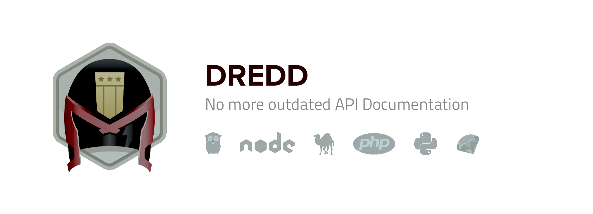
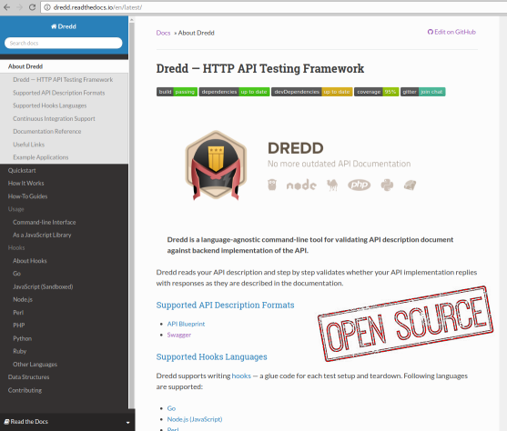
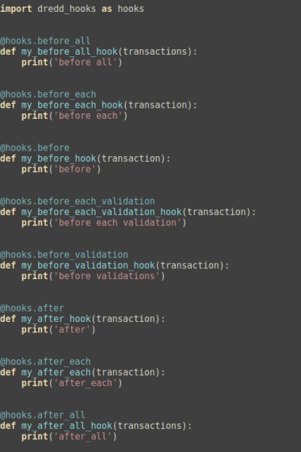
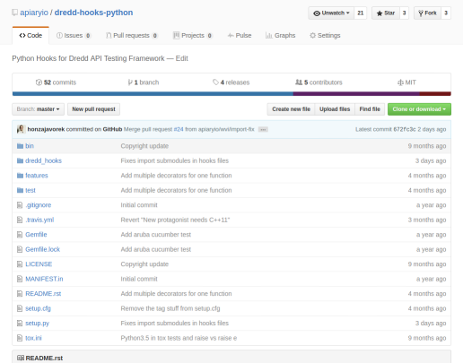

# Web API testing
### should be easy

*Vilibald Wanča - wvi@apiary.io*


---

## About me

- Double digit years of experience in the business
- Basic -> Pascal -> asm x86 -> C/C++ -> Python, Lisp, Go ...
- Dealing with Web APIs way too long (since early 2000s)

*Currently I am a Bee in Apiary (apiary.io)*

---

## Outline

- What this is not about
- API is a contract
- Verifying that nobody breaches the contract
- Here comes the API Judge Dredd
- Hooking stuff up
- Talk is cheap here comes the action

*Ask questions straight away, don't wait for Q&A*

---

## I am not going to talk about

- RPC style APIs (ie. json-rpc)
- XML based APIs (long live SOAP)


---

## API is a contract

> A promise to perform described action when asked in the correct manner

---

## Rule no. 1 when dealing with contracts?

<blockquote>
<p class="fragment" data-fragment-index="1">Get everything in writing before you commit to it!</p>
</blockquote>

---

## How to write such contract?

1. Choose your text editor.
2. Choose a proper format.
3. Write it down.
5. Verify.
4. Publish.
6. &#36;&#36;&#36;

---

### API Blueprint


```md

## Group Question

Resource related to questions in the API.

## Question [/questions/{question_id}]

A Question object has the following attributes.

- question
- published_at
- url
- choices (an array of Choice objects).

+ Parameters
    + question_id: 1 (required, number)

### View a question detail [GET]

+ Response 200 (application/json)

        {
            "question": "Favourite programming language?",
            "published_at": "2014-11-11T08:40:51.620Z",
            "url": "/questions/1",
            "choices": [
                {
                    "choice": "Swift",


```

---

### Swagger / Open API Spec.


```yaml
      properties:
              questions_url:
                type: string
            required:
              - questions_url
  /questions/{question_id}:
    x-summary: Question
    x-description: >-
      A Question object has the following attributes.

      - question
      - published_at
      - url
      - choices (an array of Choice objects).
    parameters:
      - name: question_id
        in: path
        required: true
        type: number
        format: int32
        description: ID of the Question in form of an integer
        enum:
          - 1

```

---

## Verifying the contract

<h3 class="fragment" data-fragment-index="1">How many of you actually
do it?</h3>
<h3 class="fragment" data-fragment-index="2"> Why?</h3>

---

## It is tedious and error prone!

```
    Until suicidal do :

       1: Perform request...
       2: Assert status code...
       3: Assert headers...
       4: Assert body payload...
       5: Go to 1
```

---


---

### Psychotherapy won't help
### SSRI won't help
### Drinking won't help
### Antipsychotics won't help

> It is not hopeless!

---

## Dredd will!



[dredd.readthedocs.org](https://dredd.readthedocs.org)

[github.com/apiaryio/dredd](https://github.com/apiaryio/dredd)

---



---

## Features you want

- validates headers, body etc.
- allows hooking into the tests
- easy to use in CI (Circle CI, Travis, Jenkins)
- many reporters
- hooks in many languages
  + JavaScript
  + Ruby
  + Python
  + PHP
  + Go

---

## Hooks in Python



---



[github.com/apiaryio/dredd-hooks-python](https://github.com/apiaryio/dredd-hooks-python)

---

## It's show time


---

## Thanks a lot for your attention

Vilibald Wanča

[wvi@apiary.io]()

