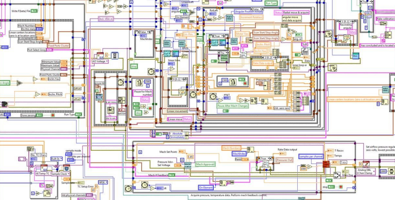
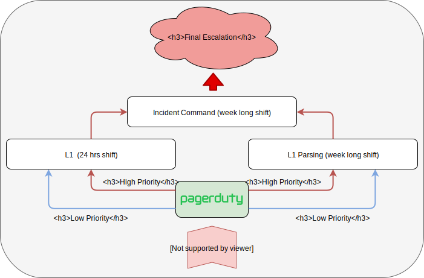

# DevOps 4 real 
### Apiary walking the walk

*Vilibald Wanča - vilibald@wvi.cz*

---

## Who the hell is this guy

Running the show in Apiary/Oracle as of now.

*Architecture, Firefighting, Infrastructure*

---

## Disclaimer

*I am going to talk about what used to be Apiary as I am not allowed to talk
about the current state.*

---

## What am I going to talk about

- What is Apiary
- Infrastructure in Apiary
- SDLC
- Ops? What Ops?

*Ask questions straight away, don't wait for Q&A*

---

## What is Apiary

Apiary is a platform designed to help companies to accelerate and control the
development of their APIs.

*Marketing alert*

---

## What is Apiary for real

---

## Some facts

- ~ 400K users
- ~ 500K API projects
- 15 req/s on parsing
- 99.95% uptime SLA (~5 hrs a year)
- No scheduled downtime
- Team is ~20 devs

---

## Apiary architecture

---

> In many ways oldschool.

Core is a classic 3 tier monolith

The rest is so called "cloud native"

---

---

## How we scale it?

> Mostly classic approach

More application instances

Asynchronous processing (scaling workers)

Database sharding

"Serverless"

---

## Tech stack

- Node.js
- Redis (cache)
- MongoDB (main database)
- Little PostgreSQL
- Parsing is C/C++
- RabbitMQ
- Tools are in Go 
- Data analysis is Python

---

## SDLC

> Software development life cycle

---

## How we do it

- Git everything
- Code review everything
- CI all the time
- CD everywhere but production
- Trello + Github + Slack
- Automate, automate, automate
- Zapier, webhooks, bots

---

## From idea to commit

> Trello or/and Github

- Some form of agile
- Trello boards for everything (automated)
- Github issues
- Regular planning sessions

---

## From commit to prod

---

## Oops! Where is Ops?

---

## No Ops but DevOps

> **Every engineer is on call***

<small>* unless junior or recently joined  </small>

---

## On call 

---

## Incident management

---

## High Priority 

> Wake them up

- Run books
- One communication channel
- Always do a post mortem 
- Regular reviews

---

## Low Priority

> Let them sleep

- Investigate
- Fix
- Add to backlog
- Leave it as is
- Regular reviews

---

## SRE team

> The only team not doing any product work

- Running basic infrastructure
- Guidance on tech decisions
- Pre-baking solutions for logging, monitoring, alerting
- Helping other teams to operate the service(s)
- Senior SREs are Incident command

---

## This presentation is over

